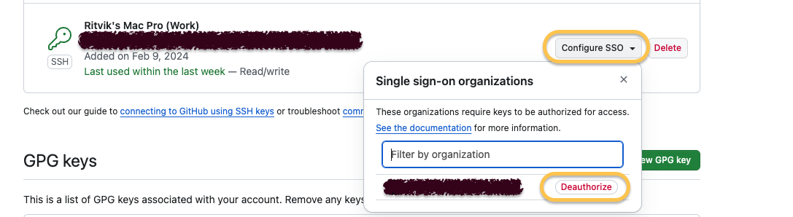

# Mac-Quickstart

A collection of scripts and commands useful for "quick-start" setup of a brand-new Macbook Laptop (Apple Silicon preferred)

-   [Bootstrap SSH for GitHub](#bootstrap-ssh-for-github)
    -   [Common Issues](#common-issues)
        -   [403 Forbidden with `git push`](#403-forbidden-with-git-push)
        -   [Write Access Not Granted with `git push`](#write-access-not-granted-with-git-push)
        -   [Error: Cannot run GPG](#error-cannot-run-gpg)
-   [Questions?](#questions)

## Bootstrap SSH for GitHub

> **_Why?_** Suppose you have 2 GitHub accounts. One for _personal_, another for _work_.
>
> The **best** (and **only**) approach for this scenario is to use SSH with `git`.

Start out by downloading the `bootstrap_ssh_for_github.sh` shell script
to [set up SSH](https://docs.github.com/en/authentication/connecting-to-github-with-ssh) (and GPG for [commit verification](https://docs.github.com/en/authentication/managing-commit-signature-verification/about-commit-signature-verification)) on GitHub:

```sh
curl -fsSL https://raw.githubusercontent.com/rnag/Mac-Quickstart/main/scripts/bootstrap_ssh_for_github.sh -o bootstrap_ssh_for_github.sh
```

Then, open the shell script in a text editor.

```sh
open -e bootstrap_ssh_for_github.sh
```

Replace the following values with your actual GitHub account info:

```
    'Personal|user1|user1@example.com'
    'Work|user2|user2@example.com'
```

Then, run the script:

```sh
/bin/bash bootstrap_ssh_for_github.sh
```

Watch for user input.

**Notes**:

-   This is a guided script.
-   Passwords will be masked.
-   Public and private keys will be temporarily copied to your clipboard, to aid in the setup process.

### Common Issues

#### 403 Forbidden with `git push`

After running script, you still receive
an HTTP `403` error upon `git push`.

```console
$ git push
remote: Permission to <user>/<repo>.git denied to <your-user>.
fatal: unable to access 'https://github.com/<user>/<repo>/': The requested URL returned error: 403
```

##### Cause

You might be currently set up to use HTTPS (instead of SSH) for `git`.

Note that `insteadOf` in git config does not chain. [This SO post][1] (along with its answer) might be helpful.

[1]: https://stackoverflow.com/q/77983896/10237506

##### Solution

Add the following lines to your `~/.dotfiles/<Project>-github.gitconfig` file.

> Replace `<user>` with your GitHub username.

```ini
[url "git@github.com-<user>:"]
    insteadOf = git@github.com:
    insteadOf = https://github.com/
```

Now, try that again:

```sh
git push
```

#### Write Access Not Granted with `git push`

After running script, you now receive "Write access to repository not granted" message with `git push`.

```console
$ git push
ERROR: Write access to repository not granted.
fatal: Could not read from remote repository.

Please make sure you have the correct access rights
and the repository exists.
```

##### Cause

I'm not entirely certain on the cause, but in my case it turns it out I had extraneous identities on `ssh-agent` that I had previously deleted.

I also had too many `ssh-agent` processes running, which could have contributed to the issue.

##### Solution

> See [my answer on SO](https://stackoverflow.com/a/77982773/10237506), for the full steps I ran.

If using Enterprise Cloud, you might need to
[authorize the SSH key for use with SAML](https://docs.github.com/en/enterprise-cloud@latest/authentication/authenticating-with-saml-single-sign-on/authorizing-an-ssh-key-for-use-with-saml-single-sign-on).

Under [Settings > SSH and GPG keys](https://github.com/settings/keys) on your target GitHub account, find your SSH key and ensure SSO is enabled.

Choose `Configure SSO` and `Authorize` - see image below.



Next, to be safe I closed most if not all open terminal windows.

Then to kill all running `ssh-agent` processes, I ran:

```sh
kill $(pgrep ssh-agent)
```

Just to be safe, restart `ssh-agent` if needed:

```sh
test -z "$SSH_AUTH_SOCK" && eval "$(ssh-agent -s)"
```

Now ensure any SSH key(s) are added to the agent:

> Note: Replace `<user>` with your GH username.

```sh
ssh-add ~/.ssh/id_ed25519_<user>
```

Run `git push` again, and should have no errors.

Also, open a new terminal window to confirm with `ssh-add -l` that all your identities are preserved in a new shell session.

#### Error: Cannot run GPG

> This error is usually seen in an IDE Terminal.

When committing code, you see:
```
error: cannot run gpg: No such file or directory
error: gpg failed to sign the data
fatal: failed to write commit object
```

##### Cause

This [StackOverflow question](https://stackoverflow.com/questions/36941533/git-hub-desktop-on-mac-error-cannot-run-gpg-no-such-file-or-directory) might help.

##### Solution

Run the following command to resolve the issue:

```sh
git config --global gpg.program "$(which gpg)"
```

## Questions?

Let me know if there are any issues or feedback.

Feel free to reach out [via email](mailto:me@ritviknag.com).

You can also [open an issue](https://github.com/rnag/Mac-Quickstart/issues) if there is a feature or suggestion you'd like to see. Contributions are welcome.
